# COMSATS Connect

> A Socket.IO communication system for COMSATS University Islamabad, with users, groups, a browser chat client, an admin console and server-enforced communication boundaries.

**Course:** Advanced Web Technologies (Semester 7) | **Assignment:** Lab Assignment 1, CLO-5 (Socket.IO)
**Author:** Muaaz Tasawar | **Repository:** https://github.com/MuaazTasawar/comsats-connect

---

## Table of Contents

1. [Overview](#1-overview)
2. [Features](#2-features)
3. [Screenshots](#3-screenshots)
4. [Tech Stack](#4-tech-stack)
5. [How This Meets the Assignment](#5-how-this-meets-the-assignment)
6. [Roles and Communication Rules](#6-roles-and-communication-rules)
7. [Architecture](#7-architecture)
8. [Web Interface](#8-web-interface)
9. [Project Structure](#9-project-structure)
10. [Getting Started](#10-getting-started)
11. [Environment Variables](#11-environment-variables)
12. [Demo Accounts and Seed Data](#12-demo-accounts-and-seed-data)
13. [Demo Walkthrough in the Browser](#13-demo-walkthrough-in-the-browser)
14. [Running the Automated Demo](#14-running-the-automated-demo)
15. [REST API Reference](#15-rest-api-reference)
16. [Socket.IO Reference](#16-socketio-reference)
17. [Manual Testing Guide](#17-manual-testing-guide)
18. [Error Codes](#18-error-codes)
19. [Data Storage](#19-data-storage)
20. [Security Notes](#20-security-notes)
21. [Troubleshooting](#21-troubleshooting)
22. [Phase Build History](#22-phase-build-history)
23. [Limitations and Future Work](#23-limitations-and-future-work)
24. [Contributing](#24-contributing)
25. [License](#25-license)

---

## 1. Overview

COMSATS Connect is a university communication platform. Administrators, faculty and students are registered as users, organised into groups (classes, courses, departments, societies, FYP teams and offices), and talk to each other in real time over Socket.IO.

The central idea is the **communication boundary**: the server decides who may read and post in each group and who may send direct messages. The rules model how communication works at COMSATS. For example, the Exam Cell can post official notices that students can read but not reply to, a faculty-only announcement group is read-only for students, and a society president can mute a disruptive member.

All rules live in one place (`permissionService.js`) and are checked on the server for every message. A client cannot bypass them by editing front-end code or by forging a group ID.

The project has two parts that share the same rules:

- **Backend:** an Express REST API for administration plus a Socket.IO engine for real-time messaging.
- **Frontend:** a browser client with no build step. A chat page for everyone, and an admin console for administrators to add users and manage groups. The chat page shows the boundaries as they apply to you, for example a locked message bar in read-only groups.

There is also an automated demo script (`tests/demo.js`) that connects several users at once and prints exactly which messages are delivered and which are blocked.

---

## 2. Features

**Communication boundaries (enforced on the server)**

- **Membership boundary:** only members can join a group's Socket.IO room, read its history or receive its messages. Non-members never receive its events, not even admins.
- **Posting policies:** each group is `everyone`, `faculty_only` or `admin_only`.
- **Muting:** a group owner or admin can mute a member, who can still read but not post.
- **Group creation rules:** admins can create any group, faculty can create course and FYP groups, students can create society and FYP groups (open posting only).
- **Direct messages:** admins and faculty can message anyone. Students can message only people who share an open group with them, or who have messaged them first.
- **Abuse control:** per-socket rate limiting, a message length cap, a request body size cap, and login attempt lockout.

**Users and groups**

- **User management:** admin-created accounts for three roles (admin, faculty, student) with COMSATS-style login IDs (for example `FA23-BCS-050`). Accounts can be deactivated, and a deactivated user is disconnected immediately.
- **Groups:** six group types (class, course, department, society, FYP, office) with owners, members, descriptions and renaming.
- **Live membership sync:** adding or removing a member updates the user's live socket rooms instantly, with no reconnect.

**Real-time messaging**

- **Presence:** online and offline updates are shared only with people who share a group with the user.
- **Typing indicators:** shown only for people who are actually allowed to post.
- **Message history:** paged history for groups and direct conversations.
- **Authentication:** one JWT works for both the REST API and the Socket.IO handshake.

**Browser interface**

- **Chat page:** groups sorted by type with lock icons on restricted groups, direct messages with online dots, unread counts (also in the browser tab title), day separators, "Load earlier messages", and a message box that turns into a locked bar when you cannot post.
- **Members panel and dialogs:** view members, mute, remove, add people, edit or leave a group, create a group, start a direct message.
- **Admin console:** add, search, filter, edit, reset the password of, deactivate and reactivate users, and create, edit, manage and delete any group.
- **Live updates everywhere:** a new group, a removal, a mute or a deactivation shows up in open browsers without a refresh.
- **Reconnect handling:** after a dropped connection the page reloads anything it missed.
- **Per-tab sessions:** every browser tab keeps its own login, so you can test several users side by side.
- **Responsive and accessible:** the sidebar becomes a drawer on small screens, keyboard focus is visible, controls have labels, and animations respect "reduce motion".

**Persistence**

- Data survives restarts using a human-readable JSON file, with no database install.

---

## 3. Screenshots

All screenshots are taken from the running application with the demo data from [Demo Accounts and Seed Data](#12-demo-accounts-and-seed-data).

### Sign in

The left panel states the three boundary rules. The demo account buttons fill in the form with one click.

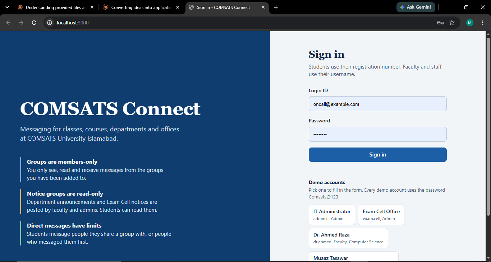

### Chat as a student

Muaaz Tasawar (student) in the BCS-7A class group. Groups are sorted by type, and the lock icon marks the two groups where students cannot post: CS Department Announcements and Exam Cell Notices. The header shows the group type, the posting policy and the member count.

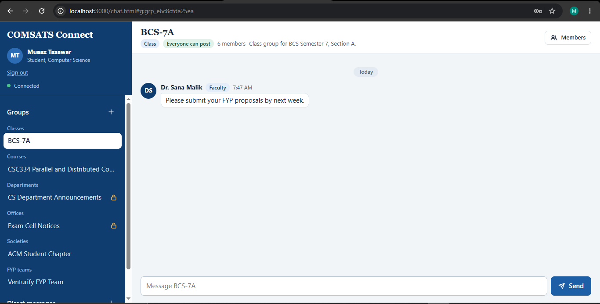

### Read-only group

In CS Department Announcements the posting policy is "Faculty and admins post". The student can read the notices, but the message box is replaced by a locked bar that explains why.

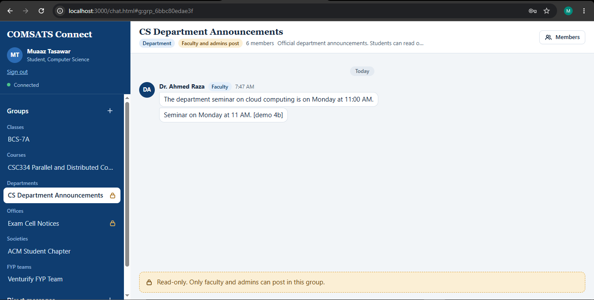

### Chat as faculty

Dr. Ahmed Raza (faculty) in the CSC334 course group. Faculty post freely in groups that allow it and can start a direct message with anyone, such as the student in the Direct messages list.

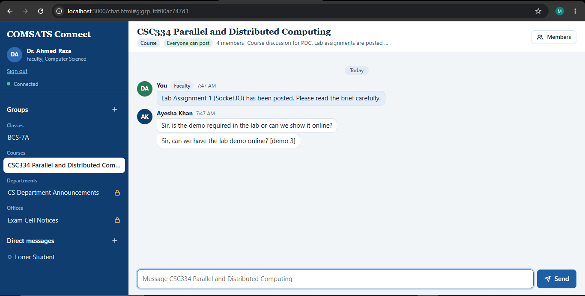

### Members panel

The group owner sees every member with Mute and Remove buttons, and an "Add people" search to bring in more members.

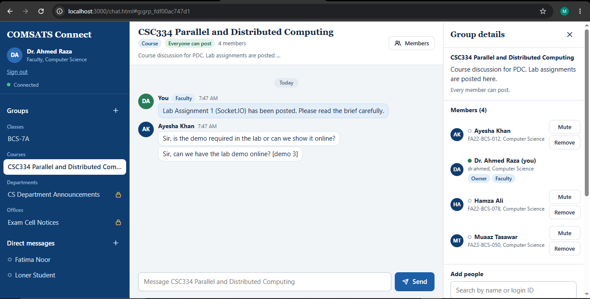

### Muting a member

After the owner presses Mute, the member shows a Muted tag and the button becomes Unmute. The muted student can still read the group, but their message box locks live.

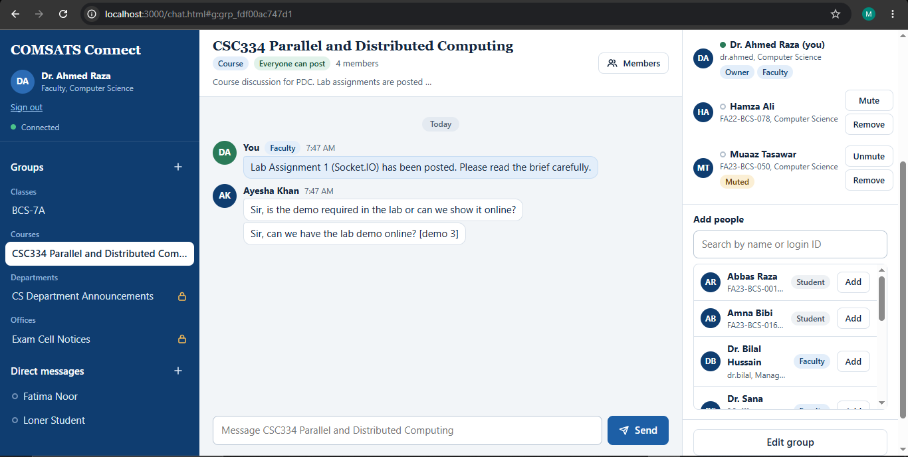

### Group creation is limited by role

A student opening "Create a group" is offered only Society and FYP team. The "Who can post" list contains only "Everyone can post". Faculty and admins see wider lists.

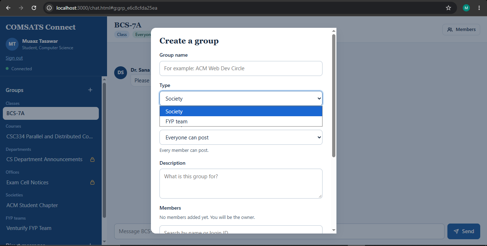

### Direct message boundary

Muaaz and Usman Raza are both in the read-only Exam Cell Notices group, but they share no open group. A read-only notice board does not make two students contacts, so the server refuses the message and the page shows the reason. The earlier "Hi!" in the same chat was sent before this rule was tightened.

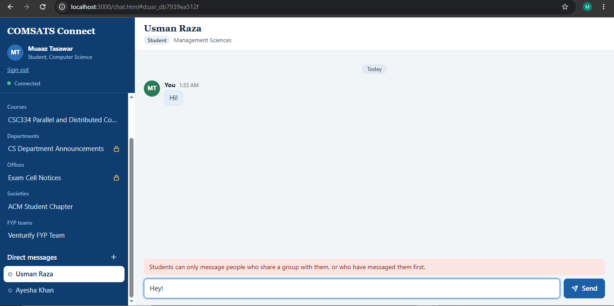

A student with no groups at all is blocked the same way.

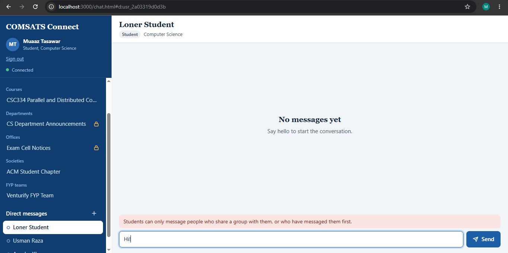

### Admin console: users

Admins see every account with role, department, status and last sign-in. They can add, edit, reset the password of, deactivate and reactivate users.

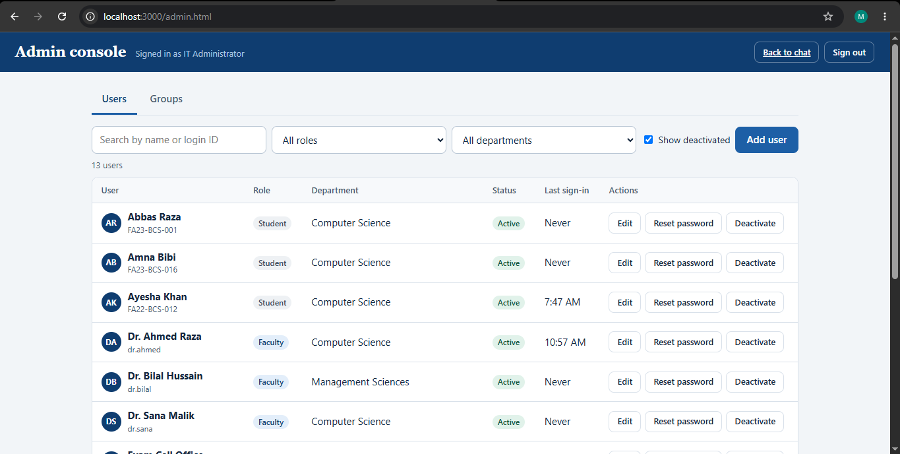

### A new user has no groups yet

A newly added student signs in and sees no groups, because membership is the boundary. An admin or a group owner has to add them.

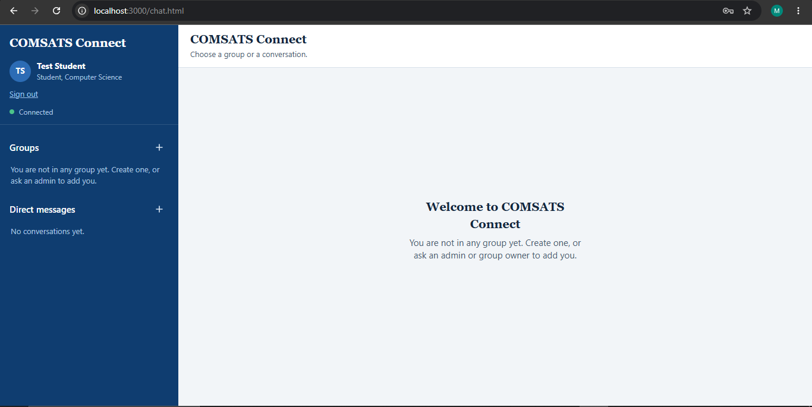

### Admin console: managing a group

Admins can rename a group, edit its description, change who can post, and manage its members.

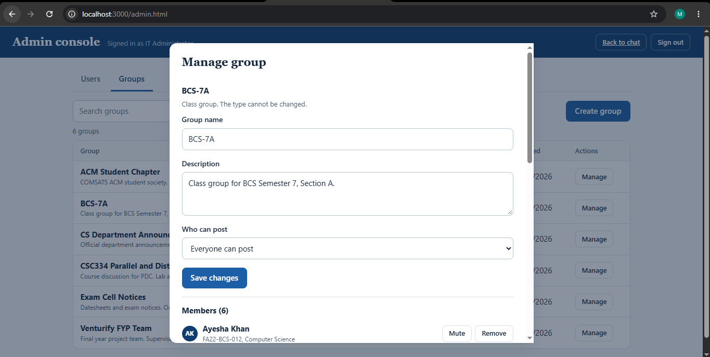

The member list shows the group owner, admins, and muted members, with Mute, Unmute and Remove buttons, plus a search to add people.

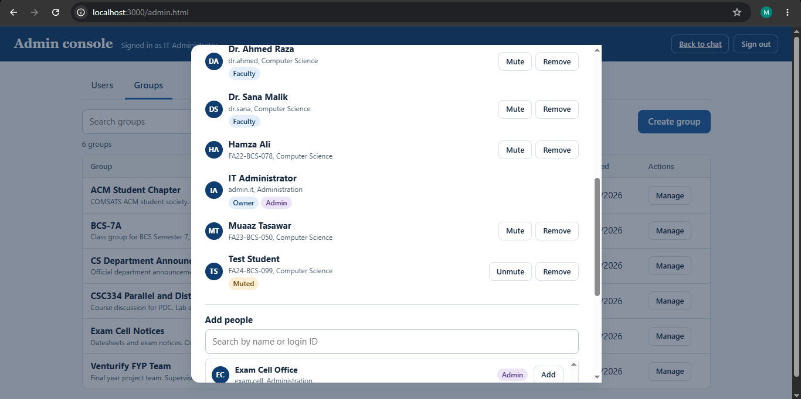

### Deactivating a user

Deactivation asks for confirmation. The user is signed out right away and cannot sign in again until reactivated.

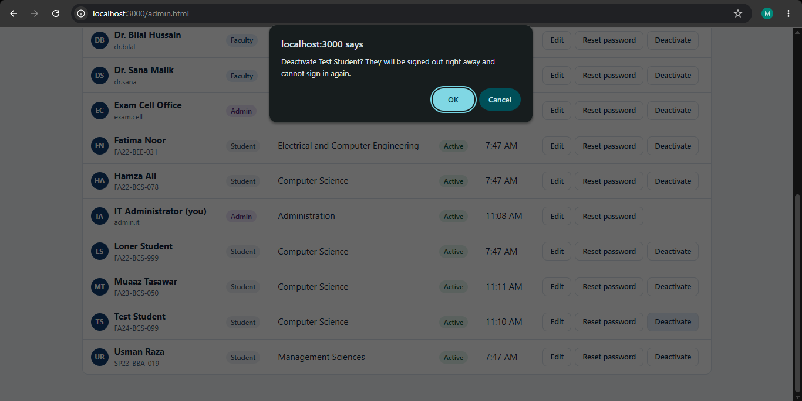

### Creating a group as an admin

Library Notices was created as an Office group with the "Admins post" policy. The dialog opens straight away so members can be added.

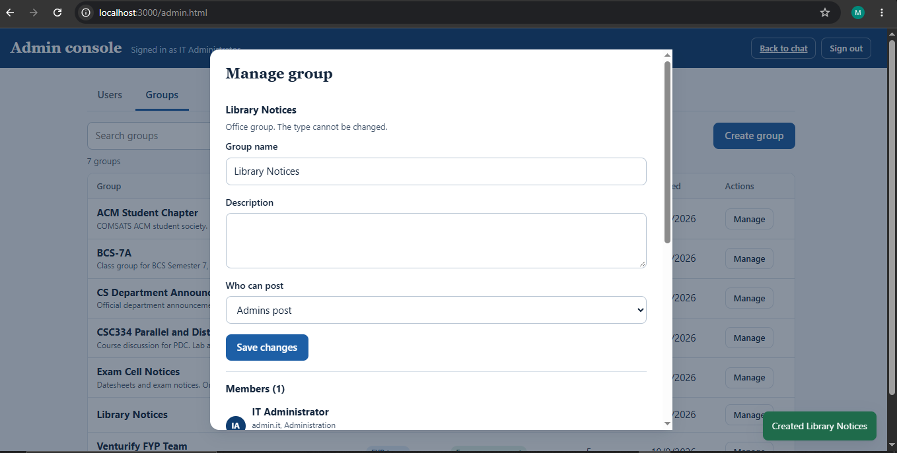

---

## 4. Tech Stack

| Layer | Technology | Notes |
|-------|------------|-------|
| Runtime | Node.js 18+ | Uses the built-in `fetch` in the demo |
| HTTP server | Express 5 | REST API, and serves the `public` folder |
| Real-time | Socket.IO 4 | Rooms, acknowledgements, handshake auth |
| Authentication | JSON Web Tokens (`jsonwebtoken`) | Shared by REST and sockets |
| Password hashing | `bcryptjs` | 10 salt rounds |
| Storage | JSON file (`server/data/db.json`) | Zero install, easy to inspect |
| Frontend | Plain HTML, CSS and JavaScript | No build step, no framework, no CDN. The Socket.IO client comes from the server at `/socket.io/socket.io.js` |
| Fonts | System fonts (Segoe UI) and Georgia | Works offline |
| Configuration | `dotenv` | Settings come from `.env` |
| Cross-origin | `cors` | Origins controlled by `CLIENT_ORIGIN` |
| Dev tools | `nodemon`, `socket.io-client` | Auto-restart and the demo client |

---

## 5. How This Meets the Assignment

| Assignment requirement | Where it is implemented |
|------------------------|-------------------------|
| Create a communication system using Socket.IO | `server/sockets/index.js` and `server/server.js` |
| Different users can be added | `POST /api/users` (admin), `userService.createUser`, the Admin console, `server/seed.js` |
| Their groups can be created | `POST /api/groups`, `groupService.createGroup`, the Create group dialogs in the chat page and the Admin console |
| Communication boundaries define who can communicate in which group | `server/services/permissionService.js` (membership, posting policy, muting, DM rules) |
| Realistic COMSATS requirements | Exam Cell notices, faculty announcements, class and course groups, societies, FYP teams, supervisor access, registration-number logins |
| A way to see it working | The browser chat client and admin console, plus `tests/demo.js` for an automated multi-user run |

---

## 6. Roles and Communication Rules

### Roles

| Role | Typical account | Login ID format |
|------|-----------------|-----------------|
| `admin` | IT office, Exam Cell, Admissions | Username, for example `exam.cell` |
| `faculty` | Teachers and supervisors | Username, for example `dr.ahmed` |
| `student` | Registered students | Registration number, for example `FA23-BCS-050` |

### Group types

| Type | Example |
|------|---------|
| `class` | BCS-7A |
| `course` | CSC334 Parallel and Distributed Computing |
| `department` | CS Department Announcements |
| `society` | ACM Student Chapter |
| `fyp` | Venturify FYP Team |
| `office` | Exam Cell Notices |

### Posting policy (who may write in a group)

| Policy | Who can post | Typical use |
|--------|--------------|-------------|
| `everyone` | Every member who is not muted | Class and course discussion |
| `faculty_only` | Faculty and admin members | Department announcements |
| `admin_only` | Admin members | Official exam and office notices |

In every case the user must also be a **member** and must **not be muted**.

### Who can create which groups

| Role | Allowed types | Allowed posting policies |
|------|---------------|--------------------------|
| admin | All six types | everyone, faculty_only, admin_only |
| faculty | course, fyp | everyone, faculty_only |
| student | society, fyp | everyone |

The creator becomes the group's **owner**.

### Who can manage a group

Admins and the group owner can add members, remove members, mute and unmute members, rename the group, change its description and posting policy, and delete it. Ordinary members can only leave on their own.

Extra protections: the owner cannot be removed or muted (delete the group instead), admins cannot be muted, and the last active admin account cannot be deactivated.

### Membership boundary

- Only members can join a group room, read its history or receive its messages.
- This applies to admins too. An admin can inspect a group's roster over REST (and in the Admin console), but cannot read its messages unless they are a member.
- Removing a member immediately removes their live socket from the group room.

### Direct messages

| Sender role | Who they may message |
|-------------|----------------------|
| admin | Anyone |
| faculty | Anyone |
| student | Only people who share at least one **open group** (posting policy `everyone`) with them, or who have already messaged them first |

Sharing a read-only notice group, such as Exam Cell Notices or CS Department Announcements, does **not** make two students contacts. Without this rule every student would share the Exam Cell Notices group with every other student, and the direct message boundary would never block anyone.

You cannot message yourself or a deactivated account.

### Abuse control

| Control | Default |
|---------|---------|
| Message length cap | 2000 characters |
| Message rate limit | 10 messages per 10 seconds per socket |
| Typing events rate limit | 50 per 10 seconds per socket |
| Login lockout | 5 failed attempts per minute for the same IP and login ID |
| Request body size | 100 KB |
| Socket payload size | 100 KB |
| Group size | 500 members |

---

## 7. Architecture

```
          +-----------------------------------------------------------+
          |                          Clients                          |
          |  Browser (chat.html, admin.html)   demo script   Postman  |
          +-------------+-----------------------------+---------------+
                        | REST (JWT)                  | Socket.IO (JWT in handshake)
                        v                             v
  +-------------------------------------------------------------------------+
  |                         Express + Socket.IO                             |
  |                                                                         |
  |  public/ (static)   routes/*          sockets/index.js    middleware/*  |
  |  the web client     (REST API)        (real-time engine)  (auth, errors)|
  +----------------------------+-------------------------+------------------+
                               |                         |
                               v                         v
  +-------------------------------------------------------------------------+
  |                    Domain services (the rules)                          |
  |                                                                         |
  |       userService       groupService       permissionService            |
  +--------------------------------+----------------------------------------+
                                   |
                                   v
  +-------------------------------------------------------------------------+
  |            store/db.js  ->  server/data/db.json                         |
  +-------------------------------------------------------------------------+
```

### The single path rule

Both the REST routes and the Socket.IO handlers call the **same service functions**. For example, every group message goes through `groupService.postMessage`, which re-checks membership, mute status and posting policy against the database. There is no code path that posts a message without those checks. The browser only mirrors the rules to decide what to show (for example the locked bar), and the server makes the real decision on every message.

### Socket.IO rooms

| Room | Who is in it | Used for |
|------|--------------|----------|
| `user:<userId>` | Every socket of that user | Direct messages, personal notifications |
| `group:<groupId>` | Sockets of that group's members only | Group messages, typing, presence, updates |

On connection a socket is placed in its user room and in one room per group the user belongs to. Membership changes made over REST add or remove live sockets from rooms.

### Life of a group message

```
Client emits  group:message { groupId, text }
      |
      v
1. Handshake JWT already verified when the socket connected
2. User re-read from the database (is the account still active?)
3. Per-socket rate limiter
4. groupService.postMessage
      - group exists?
      - member of the group?
      - not muted?
      - role allowed by the posting policy?
      - text valid and within the length cap?
5. Message saved to the store
6. Server broadcasts group:message to room group:<groupId>
7. Sender's acknowledgement callback receives { ok: true, message }
```

If any check fails, the sender's acknowledgement receives `{ ok: false, error: { code, message } }` and nothing is broadcast. In the browser, the reason is shown above the message box.

---

## 8. Web Interface

The server serves the `public` folder, so the whole interface is available at **http://localhost:3000** with no build step.

### Pages

| URL | File | Who | Purpose |
|-----|------|-----|---------|
| `/` or `/index.html` | `public/index.html` | Everyone | Sign in, with one-click demo accounts |
| `/chat.html` | `public/chat.html` | Signed-in users | Group and direct messaging |
| `/admin.html` | `public/admin.html` | Admins only | User and group management. Other roles are sent back to the chat page |

A direct link to a conversation works: `chat.html#g:<groupId>` opens a group and `chat.html#d:<userId>` opens a direct message.

### Chat page

| Area | What it does |
|------|--------------|
| Sidebar | Your name and role, connection status, groups sorted by type (Classes, Courses, Departments, Offices, Societies, FYP teams), direct messages with online dots, and unread counts |
| Lock icon | Marks groups whose posting policy is not "everyone" |
| Header | Group name, type, posting policy, member count and description, and a Members button |
| Message list | Messages grouped by sender and day, role badges for faculty and admins, and "Load earlier messages" for older history |
| Message box | Enter sends and Shift+Enter adds a new line. In a read-only group or when muted it becomes a locked bar with the reason |
| Typing line | Shows who is typing in the open chat |
| Members panel | Member list, mute, remove, add people, edit group, leave group and delete group, depending on your rights |
| Dialogs | Create a group, start a direct message, edit a group |
| Toasts | Live notices: you were added, removed, muted or unmuted |

### Admin console

| Tab | What it does |
|-----|--------------|
| Users | Search and filter by role and department, add a user, edit name and department, reset a password, deactivate or reactivate an account |
| Groups | Search and filter by type and posting policy, create any group, and open Manage to edit settings, add, mute or remove members, and delete the group |

### How the frontend works

| File | Responsibility |
|------|----------------|
| `public/js/api.js` | Session storage, REST calls with the token, socket connection and acknowledgement helper, small DOM helpers, labels |
| `public/js/login.js` | Sign-in form, demo account buttons, resume of an existing session |
| `public/js/chat.js` | Socket connection, group and conversation lists, messages, composer, typing, unread counts, reconnect sync |
| `public/js/chat-panels.js` | Members panel and the create group, new direct message and edit group dialogs |
| `public/js/admin.js` | Admin console tabs, user and group management |
| `public/css/styles.css` | Shared styles and the login page |
| `public/css/chat.css` | Chat page layout |
| `public/css/admin.css` | Admin console layout |

Design notes:

- **Per-tab sessions:** the token is kept in `sessionStorage`, not `localStorage`, so each tab has its own login. Open one tab as a student and another as faculty to watch messages and blocks happen live. Closing the tab signs you out.
- **Server is the authority:** the browser reads `/api/meta` and the group data to decide what to show, but never to decide what is allowed. If a rule is bypassed in the browser, the server still refuses the message.
- **Safe rendering:** all message text and names are inserted with `textContent`, never `innerHTML`, so a message cannot inject markup.
- **Same-origin:** because the pages and the API come from the same server, no CORS setup is needed for the bundled client.

---

## 9. Project Structure

```
comsats-connect/
├── server/
│   ├── config/
│   │   └── policies.js            Roles, group types, rules, limits, event names
│   ├── data/
│   │   └── .gitkeep               Keeps the folder in Git (db.json is generated)
│   ├── store/
│   │   └── db.js                  JSON file store, AppError, history paging
│   ├── services/
│   │   ├── userService.js         Users, login, direct message storage
│   │   ├── groupService.js        Groups, membership, muting, group messages
│   │   └── permissionService.js   Every communication rule lives here
│   ├── middleware/
│   │   ├── auth.js                JWT signing and verification, role guard
│   │   └── errorHandler.js        Uniform JSON errors, async wrapper, 404
│   ├── routes/
│   │   ├── authRoutes.js          Login and current user
│   │   ├── userRoutes.js          User listing, creation, updates, DM history
│   │   └── groupRoutes.js         Groups, members, muting, history
│   ├── sockets/
│   │   ├── rateLimiter.js         Sliding-window limiter, one per socket
│   │   └── index.js               Socket.IO server, rooms, events
│   ├── seed.js                    Loads demo users, groups and messages
│   └── server.js                  Express and Socket.IO entry point, serves public/
├── public/
│   ├── css/
│   │   ├── styles.css             Shared styles and login page
│   │   ├── chat.css               Chat page layout
│   │   └── admin.css              Admin console layout
│   ├── js/
│   │   ├── api.js                 Session, REST, socket helpers, DOM helpers
│   │   ├── login.js               Sign-in page logic
│   │   ├── chat.js                Chat page logic
│   │   ├── chat-panels.js         Members panel and chat dialogs
│   │   └── admin.js               Admin console logic
│   ├── index.html                 Sign in
│   ├── chat.html                  Chat page
│   └── admin.html                 Admin console
├── docs/
│   └── screenshots/               Images used in this README
├── tests/
│   └── demo.js                    Multi-user boundary demonstration
├── .env.example                   Template for your .env
├── .gitignore
├── package.json
└── README.md
```

---

## 10. Getting Started

All commands below are for **Windows PowerShell**.

### Prerequisites

| Tool | Version | Check with |
|------|---------|------------|
| Node.js | 18 or newer | `node -v` |
| npm | Comes with Node | `npm -v` |
| Git | Any recent version | `git --version` |
| Browser | Any current Chrome, Edge or Firefox | |

If PowerShell says "running scripts is disabled" when you use `npm`, run this once:

```powershell
Set-ExecutionPolicy -Scope CurrentUser -ExecutionPolicy RemoteSigned
```

### Step 1: Clone the repository

```powershell
git clone https://github.com/MuaazTasawar/comsats-connect.git
cd comsats-connect
```

### Step 2: Install dependencies

```powershell
npm install
```

You may see a few npm audit warnings from development packages. Do not run `npm audit fix --force`, because it can break the install. They do not affect this project.

### Step 3: Create your `.env` file

```powershell
Copy-Item .env.example .env
```

Open `.env` and replace the `JWT_SECRET` value with a long random string of your own. You can generate one with:

```powershell
node -e "console.log(require('crypto').randomBytes(48).toString('hex'))"
```

All variables are explained in [Environment Variables](#11-environment-variables). The defaults work as they are, except for the secret.

### Step 4: Load the demo data

```powershell
npm run seed
```

You should see `Seed complete`, along with 12 users, 6 groups and a list of demo logins. This creates `server/data/db.json`.

### Step 5: Start the server

```powershell
npm start
```

Expected output:

```
COMSATS Connect API running on http://localhost:3000
Socket.IO is ready for connections.
```

For development with automatic restart on file changes:

```powershell
npm run dev
```

Leave this window open. The server must be running for everything below.

### Step 6: Open the web app

Go to **http://localhost:3000** in your browser and click one of the demo accounts. Student, faculty and admin accounts each see a different set of groups. Admin accounts also see an "Admin console" link under their name.

If port 3000 is busy, start the server on another port and open that address instead:

```powershell
$env:PORT = 3001
npm start
```

### Step 7: Check the API (optional)

In a **second** PowerShell window:

```powershell
Invoke-RestMethod http://localhost:3000/api/health
```

You should get `status : ok`.

### Step 8: Run the automated demo (optional)

In the second window, from the project folder:

```powershell
npm run demo
```

See [Running the Automated Demo](#14-running-the-automated-demo).

### Command summary

| Command | What it does |
|---------|--------------|
| `npm start` | Starts the server |
| `npm run dev` | Starts the server with nodemon (auto-restart) |
| `npm run seed` | Loads demo data (does nothing if users already exist) |
| `npm run seed -- --force` | Wipes the database and loads demo data again |
| `npm run demo` | Runs the boundary demo (server must be running) |
| `npm test` | Same as `npm run demo` |

---

## 11. Environment Variables

Set in `.env` (copied from `.env.example`).

| Variable | Default | Description |
|----------|---------|-------------|
| `PORT` | `3000` | Port the server listens on |
| `JWT_SECRET` | *(insecure dev fallback)* | Secret used to sign tokens. **Change this.** If missing, the server prints a warning and uses a development-only secret |
| `JWT_EXPIRES_IN` | `8h` | Token lifetime, for example `1h`, `8h`, `7d` |
| `CLIENT_ORIGIN` | `*` | Allowed browser origins. Use `*` for any, or a comma-separated list such as `http://localhost:5173,https://app.example.com` |
| `MESSAGE_MAX_LENGTH` | `2000` | Maximum characters in one message |
| `RATE_LIMIT_MESSAGES` | `10` | Messages allowed per window, per socket |
| `RATE_LIMIT_WINDOW_MS` | `10000` | Length of the rate-limit window in milliseconds |
| `HISTORY_LIMIT` | `50` | Default number of messages returned for history (maximum 200) |

The demo can also use an optional `BASE_URL` environment variable (default `http://localhost:3000`) if your server runs elsewhere:

```powershell
$env:BASE_URL = 'http://localhost:4000'; npm run demo
```

---

## 12. Demo Accounts and Seed Data

**Every demo account uses the password `Comsats@123`.** These accounts are for demonstration only. Change or remove them before any real use.

### Users

| Login ID | Name | Role | Department |
|----------|------|------|------------|
| `admin.it` | IT Administrator | admin | Administration |
| `exam.cell` | Exam Cell Office | admin | Administration |
| `dr.ahmed` | Dr. Ahmed Raza | faculty | Computer Science |
| `dr.sana` | Dr. Sana Malik | faculty | Computer Science |
| `dr.bilal` | Dr. Bilal Hussain | faculty | Management Sciences |
| `FA23-BCS-001` | Abbas Raza | student | Computer Science |
| `FA23-BCS-016` | Amna Bibi | student | Computer Science |
| `FA23-BCS-050` | Muaaz Tasawar | student | Computer Science |
| `FA22-BCS-012` | Ayesha Khan | student | Computer Science |
| `FA22-BCS-078` | Hamza Ali | student | Computer Science |
| `FA22-BEE-031` | Fatima Noor | student | Electrical and Computer Engineering |
| `SP23-BBA-019` | Usman Raza | student | Management Sciences |

The login page also lists five of these as one-click buttons: `admin.it`, `exam.cell`, `dr.ahmed`, `FA23-BCS-050` and `FA22-BEE-031`.

### Groups

| Group | Type | Posting policy | Owner | Members |
|-------|------|----------------|-------|---------|
| BCS-7A | class | everyone | admin.it | dr.ahmed, dr.sana, Muaaz, Ayesha, Hamza |
| CSC334 Parallel and Distributed Computing | course | everyone | dr.ahmed | Muaaz, Ayesha, Hamza |
| CS Department Announcements | department | faculty_only | admin.it | dr.ahmed, dr.sana, Muaaz, Ayesha, Hamza |
| Exam Cell Notices | office | admin_only | exam.cell | admin.it, all faculty, all students |
| ACM Student Chapter | society | everyone | Muaaz | Ayesha, Hamza (**muted**), Fatima |
| Venturify FYP Team | fyp | everyone | Muaaz | Abbas Raza, Amna Bibi, Ayesha, dr.sana |

A few starting messages are also loaded so history is not empty.

### Resetting to this state

```powershell
npm run seed -- --force
```

This wipes `db.json` completely and recreates the data above. If the server is running, stop it first and start it again afterwards, because it keeps the data in memory.

---

## 13. Demo Walkthrough in the Browser

Start from a fresh seed (`npm run seed -- --force`, then `npm start`). Open several tabs of **http://localhost:3000**. Each tab keeps its own login. The screenshot numbers refer to [Screenshots](#3-screenshots).

| Step | Do this | You should see |
|------|---------|----------------|
| 1 | Open the login page | The three boundary rules and the demo accounts (screenshot 1) |
| 2 | Tab A: sign in as Muaaz. Tab B: sign in as `dr.ahmed` | Each person sees only their own groups, sorted by type (screenshots 2 and 4) |
| 3 | Tab B: post in the CSC334 group while Tab A has it open | The message appears in Tab A at once. While Tab B types, Tab A shows "Dr. Ahmed Raza is typing..." |
| 4 | Tab A: open CS Department Announcements | A locked bar: "Read-only. Only faculty and admins can post in this group." (screenshot 3) |
| 5 | Tab B: post in CS Department Announcements | Tab A receives it live (or shows an unread badge if another chat is open). Faculty can post here, students cannot |
| 6 | Tab B: open Exam Cell Notices | Even faculty are locked out. Only `exam.cell` or `admin.it` can post |
| 7 | Tab B: open CSC334, press Members, then Mute next to Muaaz | Tab A shows a toast and Muaaz's message box locks, while the history stays readable (screenshots 5 and 6) |
| 8 | Tab C: sign in as Fatima | She sees only Exam Cell Notices and the ACM Student Chapter. BCS-7A is invisible to her |
| 9 | Tab A: press + next to Direct messages and send Usman Raza a message | Blocked. Muaaz and Usman only share the read-only Exam Cell Notices (screenshot 8) |
| 10 | Tab B: send Usman a direct message. Then, in a new tab as Usman, reply to Muaaz | Faculty can message anyone, and Usman can reply to Muaaz because Muaaz messaged him first |
| 11 | Tab A: press + next to Groups | Only Society and FYP team, with the "Everyone can post" policy (screenshot 7) |
| 12 | Tab D: sign in as `admin.it`, open the Admin console, add a student, then open Groups, Manage BCS-7A and add them | The new user sees BCS-7A appear live, with a toast (screenshots 10 to 13) |
| 13 | In Manage, press Mute next to the new user | Their message box locks live |
| 14 | In the Users tab, press Deactivate next to the new user | Their tab is signed out immediately and they cannot sign in again (screenshot 14) |
| 15 | Create a group, for example Library Notices as an Office group with "Admins post" | The group appears in the table and the Manage dialog opens so members can be added (screenshot 15) |
| 16 | Sign in as `FA23-BCS-050` and open `/admin.html` | The page sends you back to the chat page. The server also refuses the admin API calls for non-admins |
| 17 | Run `npm run demo` | Thirteen scenarios print PASS or FAIL for every boundary |

---

## 14. Running the Automated Demo

`tests/demo.js` is the quickest way to check every rule at once. It logs in six users, opens a Socket.IO connection for each, and runs thirteen scenarios, printing which messages were delivered and which were blocked and why. Each check prints `PASS` or `FAIL`.

### How to run it

1. Make sure the server is running (`npm start` in one window).
2. For the cleanest run, reset the data first: stop the server, run `npm run seed -- --force`, then start the server again.
3. In a second window: `npm run demo`

The demo prepares its own starting state (for example it makes sure Fatima is not in the FYP team and that Hamza is muted), and it cleans up the groups it creates, so it can be run repeatedly. It also creates one extra student, **Loner Student** (`FA22-BCS-999`), who belongs to no group. You will see this account in the Admin console after the first run. It is useful for showing the direct message boundary.

### Scenarios

| # | Scenario | What it proves |
|---|----------|----------------|
| 1 | Authentication | Sockets without a token or with a bad token are refused |
| 2 | Group listing | Each user sees only their own groups |
| 3 | Course group (`everyone`) | A student's message reaches members only, not outsiders |
| 4 | Announcements (`faculty_only`) | Students are blocked, faculty posts reach students |
| 5 | Exam notices (`admin_only`) | Faculty and students are blocked, an admin's notice reaches all members |
| 6 | Muting | A muted student can read but not post, and live unmuting works |
| 7 | Membership boundary | Non-members cannot read, post or receive. Adding and removing a member updates delivery live |
| 8 | Group creation rules | Students cannot create class groups or faculty-only societies, faculty cannot create societies |
| 9 | Direct messages | Students can DM classmates but not strangers. Faculty can DM anyone, and a reply is then allowed |
| 10 | Message validation | Empty and over-length messages are rejected |
| 11 | Rate limiting | A burst of 15 messages is partially blocked |
| 12 | Presence | Members see a user come online and go offline |
| 13 | Deactivation | A deactivated user is disconnected instantly and cannot log in |

The demo exits with code 0 when every check passes, and 1 otherwise. Set `NO_COLOR=1` to turn off colored output.

---

## 15. REST API Reference

Base URL: `http://localhost:3000`
All endpoints except `/api/health`, `/api/meta` and `/api/auth/login` need the header `Authorization: Bearer <token>`.

All errors use one format:

```json
{ "error": { "code": "NOT_MEMBER", "message": "You are not a member of this group." } }
```

### General

| Method | Path | Description |
|--------|------|-------------|
| GET | `/api/health` | Server status |
| GET | `/api/meta` | Roles, group types, policies, creation rules, departments, message limit |

### Authentication

| Method | Path | Body | Description |
|--------|------|------|-------------|
| POST | `/api/auth/login` | `{ loginId, password }` | Returns `{ token, user }` |
| GET | `/api/auth/me` | none | Returns the current user |

### Users

| Method | Path | Who | Description |
|--------|------|-----|-------------|
| GET | `/api/users` | Any user | List users. Query: `role`, `department`, `search`, `includeInactive=true` (admin only) |
| GET | `/api/users/me/conversations` | Any user | Your direct-message partners with the last message |
| GET | `/api/users/:id` | Any user | One user |
| GET | `/api/users/:id/messages` | Any user | Your DM history with that user. Query: `limit`, `before` |
| POST | `/api/users` | **Admin** | Create a user. Body: `{ loginId, name, role, department, password }` |
| PATCH | `/api/users/:id` | **Admin** | Update `name`, `department`, `active`, `password` |

### Groups

| Method | Path | Who | Description |
|--------|------|-----|-------------|
| GET | `/api/groups` | Any user | Groups you belong to, including `myGroupRole` and `muted` |
| GET | `/api/groups/all` | **Admin** | Every group |
| POST | `/api/groups` | Any user (rules apply) | Create a group. Body: `{ name, type, postPolicy?, description?, memberIds? }` |
| GET | `/api/groups/:id` | Member or admin | Group details with the member list |
| PATCH | `/api/groups/:id` | Owner or admin | Update `name`, `description`, `postPolicy` |
| DELETE | `/api/groups/:id` | Owner or admin | Delete the group, its memberships and its messages |
| POST | `/api/groups/:id/members` | Owner or admin | Add a member. Body: `{ userId }` |
| DELETE | `/api/groups/:id/members/:userId` | Owner or admin, or the member themselves | Remove a member, or leave the group |
| PATCH | `/api/groups/:id/members/:userId` | Owner or admin | Mute or unmute. Body: `{ muted: true }` |
| GET | `/api/groups/:id/messages` | **Members only** | Group history. Query: `limit`, `before` |

### History paging

`limit` returns the newest N messages (default 50, maximum 200), oldest first. To load older messages, pass `before` set to the `createdAt` of the oldest message you already have. The chat page uses this for "Load earlier messages".

### Example: create a group

```
POST /api/groups
Authorization: Bearer <token>
Content-Type: application/json

{
  "name": "Debate Society",
  "type": "society",
  "postPolicy": "everyone",
  "description": "Weekly debates",
  "memberIds": ["usr_ab12cd34ef56"]
}
```

---

## 16. Socket.IO Reference

### Connecting

Send the JWT from `/api/auth/login` in the handshake:

```js
const { io } = require('socket.io-client');
const socket = io('http://localhost:3000', { auth: { token } });
```

In the browser the client script comes from the server itself, so no install is needed:

```html
<script src="/socket.io/socket.io.js"></script>
<script>
  const socket = io({ auth: { token } });
</script>
```

A connection without a valid token, or for a deactivated account, is rejected with a `connect_error` whose `err.data.code` explains why.

### Acknowledgements

Every client-to-server event takes an acknowledgement callback as the last argument and receives one of:

```js
{ ok: true, ...result }
{ ok: false, error: { code: 'MUTED', message: '...' } }
```

### Client to server events

| Event | Payload | Success reply | Description |
|-------|---------|---------------|-------------|
| `groups:list` | none | `{ ok, groups }` | Your groups, each with `onlineMemberIds` |
| `group:message` | `{ groupId, text }` | `{ ok, message }` | Post to a group |
| `direct:message` | `{ toUserId, text }` | `{ ok, message }` | Send a direct message |
| `group:history` | `{ groupId, limit?, before? }` | `{ ok, messages }` | Group history (members only) |
| `direct:history` | `{ withUserId, limit?, before? }` | `{ ok, messages }` | Your DM history with one user |
| `typing` | `{ groupId, isTyping }` or `{ toUserId, isTyping }` | `{ ok }` | Typing indicator, silently ignored if you could not post |

### Server to client events

| Event | Payload | Sent to |
|-------|---------|---------|
| `group:message` | `{ id, groupId, senderId, senderName, senderRole, text, createdAt }` | All sockets in the group room, **including the sender** |
| `direct:message` | `{ id, fromId, toId, senderName, text, createdAt }` | Both users' personal rooms |
| `typing` | Group: `{ groupId, userId, name, isTyping }`. DM: `{ fromUserId, name, isTyping }` | Other members, or the DM recipient |
| `presence:update` | `{ userId, name, online }` | Users who share a group with that user |
| `group:added` | `{ group }` | A user who was just added to a group (and their sockets join the room) |
| `group:removed` | `{ groupId }` | A user who was removed, or all members when a group is deleted |
| `group:updated` | `{ group }` to the group room, or `{ groupId, muted }` to a user who was muted or unmuted | Members |

Because the sender is also in the group room, they receive their own message through the broadcast as well as the acknowledgement. Clients should de-duplicate by `message.id`. The chat page does this.

### Minimal client example

```js
const { io } = require('socket.io-client');

async function main() {
  const res = await fetch('http://localhost:3000/api/auth/login', {
    method: 'POST',
    headers: { 'Content-Type': 'application/json' },
    body: JSON.stringify({ loginId: 'FA23-BCS-050', password: 'Comsats@123' }),
  });
  const { token } = await res.json();

  const socket = io('http://localhost:3000', { auth: { token } });

  socket.on('group:message', (m) => console.log(m.senderName + ': ' + m.text));
  socket.on('presence:update', (p) => console.log(p.name + (p.online ? ' is online' : ' went offline')));

  socket.on('connect', () => {
    socket.emit('groups:list', {}, (reply) => {
      const group = reply.groups.find((g) => g.name === 'Venturify FYP Team');
      socket.emit('group:message', { groupId: group.id, text: 'Hello team' }, (r) => {
        console.log(r.ok ? 'sent' : 'blocked: ' + r.error.code);
      });
    });
  });
}

main();
```

---

## 17. Manual Testing Guide

You can test with the browser, with the demo, with PowerShell, or with Postman.

### With the browser

Follow [Demo Walkthrough in the Browser](#13-demo-walkthrough-in-the-browser). It covers every boundary with two or three tabs.

### With PowerShell

Log in and keep the token in a header:

```powershell
$login = Invoke-RestMethod -Method Post -Uri http://localhost:3000/api/auth/login -ContentType 'application/json' -Body '{"loginId":"FA23-BCS-050","password":"Comsats@123"}'
$h = @{ Authorization = "Bearer $($login.token)" }
```

List your groups:

```powershell
(Invoke-RestMethod -Uri http://localhost:3000/api/groups -Headers $h).groups | Select-Object name,type,postPolicy,myGroupRole,muted | Format-List
```

A student tries to create a class group (refused with `GROUP_TYPE_FORBIDDEN`):

```powershell
try { Invoke-RestMethod -Method Post -Uri http://localhost:3000/api/groups -Headers $h -ContentType 'application/json' -Body '{"name":"Fake Class","type":"class"}' } catch { $_.ErrorDetails.Message }
```

A student tries to create a user (refused with `ROLE_FORBIDDEN`):

```powershell
try { Invoke-RestMethod -Method Post -Uri http://localhost:3000/api/users -Headers $h -ContentType 'application/json' -Body '{"loginId":"FA22-BCS-099","name":"Test","role":"student","department":"Computer Science","password":"Comsats@123"}' } catch { $_.ErrorDetails.Message }
```

An admin creates a user:

```powershell
$a = Invoke-RestMethod -Method Post -Uri http://localhost:3000/api/auth/login -ContentType 'application/json' -Body '{"loginId":"admin.it","password":"Comsats@123"}'
$ah = @{ Authorization = "Bearer $($a.token)" }
Invoke-RestMethod -Method Post -Uri http://localhost:3000/api/users -Headers $ah -ContentType 'application/json' -Body '{"loginId":"FA22-BCS-099","name":"Test Student","role":"student","department":"Computer Science","password":"Comsats@123"}'
```

A non-member reads a group's history (refused with `NOT_MEMBER`):

```powershell
$f = Invoke-RestMethod -Method Post -Uri http://localhost:3000/api/auth/login -ContentType 'application/json' -Body '{"loginId":"FA22-BEE-031","password":"Comsats@123"}'
$fh = @{ Authorization = "Bearer $($f.token)" }
$gid = ((Invoke-RestMethod -Uri http://localhost:3000/api/groups/all -Headers $ah).groups | Where-Object { $_.name -eq 'Venturify FYP Team' }).id
try { Invoke-RestMethod -Uri "http://localhost:3000/api/groups/$gid/messages" -Headers $fh } catch { $_.ErrorDetails.Message }
```

### With Postman

REST endpoints work with a normal HTTP request and the `Authorization: Bearer <token>` header. Postman can also open a Socket.IO connection (New, then Socket.IO). Put the token in the **Auth** section of the handshake, then add listeners for the server events in section 16.

### Watching real-time delivery by hand

Open three PowerShell windows, save the client example from section 16 with different login IDs (for example Muaaz, Ayesha and Fatima), and run them. Messages sent to the Venturify FYP Team reach Muaaz and Ayesha but never Fatima, until you add her with `POST /api/groups/:id/members`. In the browser, the same test is steps 2 and 8 of the walkthrough.

---

## 18. Error Codes

### Authentication and request errors

| Code | HTTP | Meaning |
|------|------|---------|
| `NO_TOKEN` | 401 | No token was supplied |
| `INVALID_TOKEN` | 401 | Token is invalid, expired, or its user no longer exists |
| `INVALID_CREDENTIALS` | 401 | Wrong login ID or password |
| `TOO_MANY_ATTEMPTS` | 429 | Too many failed logins, wait one minute |
| `ACCOUNT_DISABLED` | 403 | The account has been deactivated |
| `ROLE_FORBIDDEN` | 403 | The route needs a different role (for example admin) |
| `ROUTE_NOT_FOUND` | 404 | Unknown URL |
| `BAD_JSON` | 400 | Request body is not valid JSON |
| `BODY_TOO_LARGE` | 413 | Request body over 100 KB |
| `BAD_PAYLOAD` | 400 | A required socket field is missing or malformed |
| `INTERNAL_ERROR` | 500 | Unexpected server error (details are logged on the server) |

### User errors

| Code | HTTP | Meaning |
|------|------|---------|
| `BAD_NAME` | 400 | Name must be 2 to 80 characters |
| `BAD_ROLE` | 400 | Role must be admin, faculty or student |
| `BAD_LOGIN_ID` | 400 | Login ID does not match the format for that role |
| `BAD_DEPARTMENT` | 400 | Department is not in the COMSATS list |
| `WEAK_PASSWORD` | 400 | Password shorter than 8 characters |
| `USER_EXISTS` | 409 | Login ID already taken |
| `USER_NOT_FOUND` | 404 | No such user |
| `BAD_ACTIVE` | 400 | `active` must be true or false |
| `LAST_ADMIN` | 400 | Cannot deactivate the last active admin |
| `USER_INACTIVE` | 400 | The user's account is deactivated |

### Group and membership errors

| Code | HTTP | Meaning |
|------|------|---------|
| `GROUP_NOT_FOUND` | 404 | No such group |
| `BAD_GROUP_NAME` | 400 | Name must be 2 to 60 characters |
| `BAD_DESCRIPTION` | 400 | Description too long (300 characters) or not text |
| `GROUP_EXISTS` | 409 | Group name already used |
| `GROUP_FULL` | 400 | Group has reached 500 members |
| `BAD_GROUP_TYPE` | 400 | Unknown group type |
| `BAD_POST_POLICY` | 400 | Unknown posting policy |
| `GROUP_TYPE_FORBIDDEN` | 403 | Your role cannot create that group type |
| `POST_POLICY_FORBIDDEN` | 403 | Your role cannot use that posting policy |
| `NOT_GROUP_OWNER` | 403 | Only the owner or an admin can do that |
| `ALREADY_MEMBER` | 409 | User is already in the group |
| `NOT_MEMBER` | 403 or 404 | You are not a member of that group, or the user is not a member |
| `OWNER_PROTECTED` | 400 | The owner cannot be removed or muted |
| `ADMIN_PROTECTED` | 403 | Admins cannot be muted |
| `BAD_MUTED` | 400 | `muted` must be true or false |

### Messaging boundary errors

| Code | HTTP | Meaning |
|------|------|---------|
| `MUTED` | 403 | You are muted in that group |
| `POLICY_FACULTY_ONLY` | 403 | Only faculty and admins can post here |
| `POLICY_ADMIN_ONLY` | 403 | Only admins can post here |
| `POLICY_FORBIDDEN` | 403 | Your role cannot post here |
| `DM_NOT_ALLOWED` | 403 | A student may not message that person |
| `RECIPIENT_UNAVAILABLE` | 404 | The recipient is missing or deactivated |
| `SELF_DM` | 400 | You cannot message yourself |
| `BAD_MESSAGE` | 400 | Message text must be a string |
| `EMPTY_MESSAGE` | 400 | Message is empty |
| `MESSAGE_TOO_LONG` | 400 | Message is over the length cap |
| `RATE_LIMITED` | n/a | Sending too fast. The reply includes `retryAfterMs` |
| `INACTIVE` | 403 | Your account is not active |

---

## 19. Data Storage

All data is kept in `server/data/db.json`, created on first run. It is loaded into memory at startup, and writes are batched (about 200 ms after the last change) and saved safely through a temporary file. Pending writes are flushed when the process exits, on Ctrl+C, and when nodemon restarts the server.

If `db.json` is ever corrupted, the server copies it to `db.json.corrupt-<timestamp>` and starts with an empty database. The database file, its temporary file and any corrupt backups are excluded from Git.

### Collections

| Collection | Fields |
|------------|--------|
| `users` | `id`, `loginId`, `name`, `role`, `department`, `passwordHash`, `active`, `createdAt`, `lastLoginAt` |
| `groups` | `id`, `name`, `type`, `postPolicy`, `description`, `createdBy`, `createdAt`, `updatedAt` |
| `memberships` | `groupId`, `userId`, `groupRole` (owner or member), `muted`, `joinedAt` |
| `messages` | `id`, `groupId`, `senderId`, `senderName`, `senderRole`, `text`, `createdAt` |
| `directMessages` | `id`, `fromId`, `toId`, `senderName`, `text`, `createdAt` |

Anyone who clones the repository runs `npm run seed` to create their own database.

---

## 20. Security Notes

- Passwords are hashed with bcrypt and never returned by the API.
- The user's **role and active status are read from the database on every request and every socket event**, not trusted from the token. Demoting or deactivating a user takes effect immediately.
- Failed logins are limited per IP and login ID. Login errors are deliberately generic, and a dummy hash comparison keeps timing similar when a login ID does not exist.
- Message text is stored exactly as typed (trimmed). The bundled web client renders all text with `textContent`, so messages cannot inject markup. Any other front end that displays messages must escape them to prevent cross-site scripting.
- The web client keeps its token in `sessionStorage`, so it disappears when the tab closes. Tokens expire after `JWT_EXPIRES_IN`, and an expired session sends the user back to the sign-in page.
- The browser never decides what is allowed. The checks that hide or lock controls are a convenience, and the server repeats every check.
- `JWT_SECRET` must be set to a long random value outside of local development. Never commit your `.env` file (it is in `.gitignore`).
- The demo accounts share one published password. Remove them, or change their passwords, before any real use.
- For a public deployment, set `CLIENT_ORIGIN` to your real front-end origin(s) instead of `*`, and serve over HTTPS.

---

## 21. Troubleshooting

| Problem | Cause and fix |
|---------|---------------|
| `npm : File ... cannot be loaded because running scripts is disabled` | Run `Set-ExecutionPolicy -Scope CurrentUser -ExecutionPolicy RemoteSigned` once |
| `Error: listen EADDRINUSE :::3000` | Port 3000 is taken, usually by an earlier copy of the server. Find the process with `Get-NetTCPConnection -LocalPort 3000 -State Listen`, stop it with `Stop-Process -Id <pid> -Force`, or start on another port with `$env:PORT = 3001` |
| The login page shows "Route not found" or JSON instead of the page | The server is not serving the `public` folder. Make sure `server/server.js` contains the `express.static` line and restart the server |
| "Invalid login ID or password" with a demo account | Browsers may autofill an old saved login over what you typed. Click one of the demo account buttons, or run `npm run seed -- --force` and restart the server |
| Chat area is blank | Press F12, open the Console tab and read the red error. Hard-refresh with Ctrl+F5 after any file change |
| A group does not appear after being added | The page updates live. If it does not, the socket is probably disconnected. Check the connection status under your name in the sidebar |
| Demo says it cannot reach the server | Start it with `npm start` in another window, and check `BASE_URL` if you changed the port |
| Demo says "Login failed ... Did you run npm run seed?" | The database is empty. Run `npm run seed -- --force`, then restart the server |
| Demo says a group was not found | The seed data was changed. Run `npm run seed -- --force` and restart the server |
| `[config] JWT_SECRET is not set` warning | Create `.env` with `Copy-Item .env.example .env` and set a real secret |
| Changes to `.env` have no effect | Restart the server, since `.env` is read only at startup |
| Data seems stale after running `npm run seed -- --force` while the server is running | The running server holds the old data in memory. Stop the server, seed, then start it again |
| `The database already contains users, so nothing was changed` | This is the normal safety check. Use `--force` to wipe and reseed |
| A socket connects but receives no messages | The user is not a member of that group. This is the boundary working. Check `GET /api/groups` for that user |
| Messages seem to arrive twice in a client | The sender gets both the broadcast and the acknowledgement. De-duplicate on `message.id` |
| `RATE_LIMITED` replies | You exceeded 10 messages per 10 seconds on one socket. Wait or raise `RATE_LIMIT_MESSAGES` |
| Git shows `LF will be replaced by CRLF` warnings | Harmless line-ending notices on Windows |
| `npm audit` reports vulnerabilities | They come from development packages. Do not use `--force` |

---

## 22. Phase Build History

| Phase | Name | What was built |
|-------|------|----------------|
| 0 | Project Init and Config | Project setup, `.gitignore`, `.env.example`, `package.json` scripts, and `policies.js` with all roles, group types, rules, limits and event names |
| 1 | Data Layer and Domain Services | JSON store, permission rules, user service (login, DMs), group service (groups, membership, muting, messages), and the seed script |
| 2 | Auth and REST API | JWT authentication, role guard, error handling, auth, user and group routes, and the Express server |
| 3 | Socket.IO Real-Time Engine | Authenticated sockets, room-based delivery boundaries, live membership sync, rate limiting, presence, typing |
| 4 | Demo Script and Finalize | The thirteen-scenario boundary demo |
| 5 | Frontend Foundation and Login | Static file serving, shared styles, session and API helpers, sign-in page with demo accounts |
| 6 | Chat Client | Group and direct chat, locked message bar for read-only groups, members panel, group creation, direct message dialog, unread counts, typing, presence, reconnect sync |
| 7 | Admin Console | User management and full group management for admins |

**Later changes**

- Fixed a header that showed the text "null" when a chat had no subtitle details.
- Tightened the student direct message rule so only open groups count as a shared group. Sharing a read-only notice group no longer lets two students message each other.
- Stopped tracking the temporary database files in Git.
- Added this README with screenshots and a browser walkthrough.

---

## 23. Limitations and Future Work

**Current limitations**

- The JSON file store suits a lab or small deployment. It is a single process and writes the whole file, so it does not scale to many thousands of users.
- Running more than one server instance would require a shared database and the Socket.IO Redis adapter.
- Presence and rate-limit state are held in memory and reset when the server restarts. The rate limit is per socket, so reconnecting resets the budget.
- Only text messages are supported. There are no file attachments, reactions, edits or deletions.
- There is no self-service registration or password reset. Accounts are created by admins, and users cannot change their own password.
- The web client has no read receipts, sound or desktop notifications.
- Because sessions live in `sessionStorage`, a user has to sign in again in every new tab.

**Ideas for extension**

- A real database (MongoDB or PostgreSQL) behind `store/db.js`.
- Read receipts and desktop notifications.
- File sharing for course material.
- Scheduled announcements and message pinning.
- Group join requests that an owner can approve.
- Audit logs of moderation actions.
- Email or push notifications for offline users.
- A mobile client using the same events.

---

## 24. Contributing

1. Fork the repository and create a feature branch.
2. Keep every communication rule inside `server/services/permissionService.js` so REST and Socket.IO stay consistent.
3. In the frontend, insert user text with `textContent` (the `el` helper does this) and never with `innerHTML`.
4. Add a scenario to `tests/demo.js` for any new rule, and make sure `npm run demo` passes against a freshly seeded database.
5. Use commit messages in the form `Area: short description`.
6. Open a pull request describing the change.

---

## 25. License

MIT

Copyright (c) Muaaz Tasawar